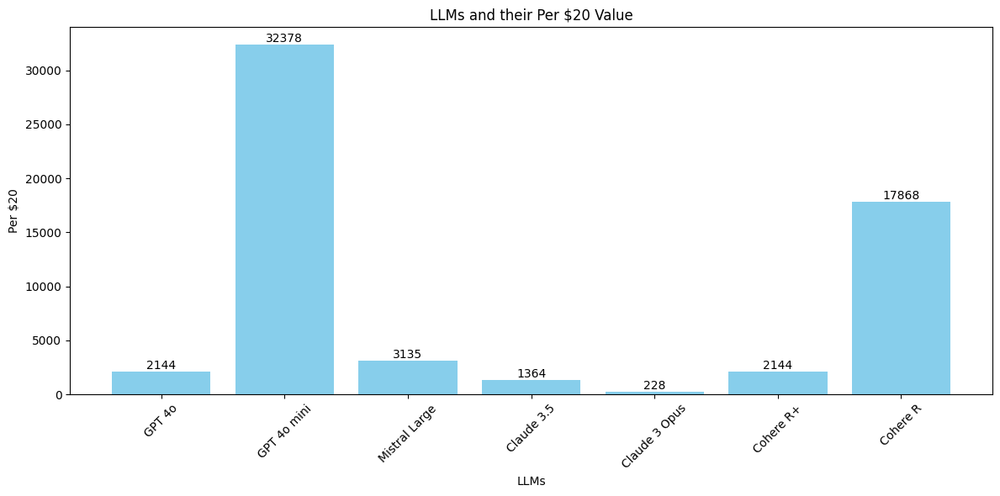
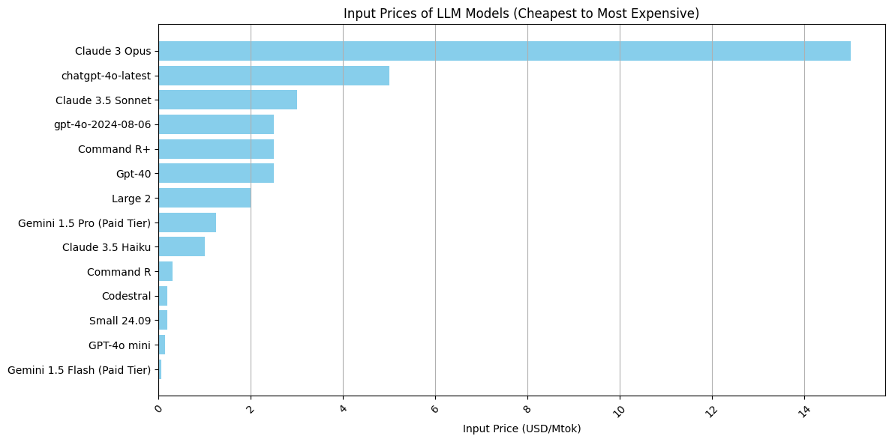
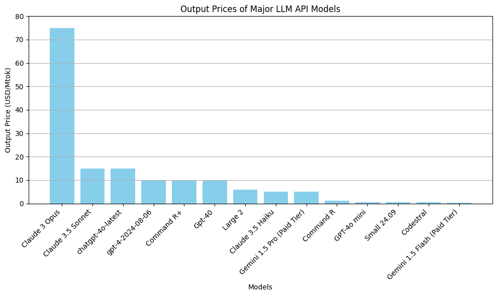

# LLM Cost Estimates: Web UIs vs APIs

## The Answer ... On 12 Nov 2024

## Summary

| LLM              | Total Cost ($) | Per $20 | Per-Day |
|------------------|------------|-----------|---------|
| GPT 4o           | 0.009328   | 2144      | 71      |
| GPT 4o mini      | 0.000618   | 32378     | 1080    |
| Mistral Large    | 0.006380   | 3135      | 105     |
| Claude 3.5       | 0.014664   | 1364      | 46      |
| Claude 3 Opus    | 0.087660   | 228       | 7.6     |
| Cohere R+        | 0.009328   | 2144      | 71      |
| Cohere R        | 0.0011193   | 17868      | 596      |

---

## Charts

### Per Month

*Based on a random prompt and output pair and using the LLMs' API pricing data available on Nov 12th 2024, how many prompts and outputs could you run every day before you reached the $20 a monthly ChatGPT sub costs?*

 

### Per Day

*.... how many would that work out to per day of a 30 day calendar month?*

 

 ## Major Cloud LLM APIs By Price - Inputs

 *Caching, volumetric, and other discounts excluded where available*

Higher values = higher cost per million tokens (of input)

 ## Major Cloud LLM APIs By Price - Outputs

 Higher values = higher cost per million tokens (of output generated)

---

## Why Calculate This?

This repository provides a few notes intended to help me (and anyone else) make some quick back-of-the-envelope style calculations to assess the comparative costs of using commercial large language models (LLMs) via APIs versus through web UIs. 

Accessing commercial LLMs through their web UIs is convenient and (from a budgetary standpoint) *"safe"*: you get a fixed monthly bill. 

But on the flip side, it becomes an increasingly frustrating way to access these tools if (or when) your usage either scales up or *professionalizes*. 

In such cases, the relatively low usage limitations encountered when accessing LLMs through tools like *ChatGPT* can quickly become cumbersome hurdles to navigate around. 

Accessing LLMs by API, on the other hand, opens up a lot of possibilities:

- Larger context windows (in some cases)  
- Less restrictive usage policies (while rate limits usually exist they may enable a far higher level of usage than the usage limits imposed on the same models' web UIs)  
- Wider selection of models, especially fine-tunes, without needing to self-host anything
- Use LLMs programatically

The flip side is that while many providers offer budgetary alerts and ceilings (and often caps) it's harder to get a feel for how your spend is going to be affected. 

My objective in compiling this data was to take a known quantity *(in this case the cost of a monthly ChatGPT Pro Sub which at the time of writing was about $20)* and to try answer the question: *"if I switched over to an API for all my prompting, how much usage would that get me?"*

Given how LLM API access is priced (token-based with different rates for inputs and outputs) this requires making some assumptions (or if you want to be more accurate or advanced, using a few sets of numbers to estimate the respective costs of lengthy prompts, short ones, etc).

Because my idea here was just to get a ballpark, I pulled a random prompt and output out of my notepad - about UI design - and placed it in `examples` where I use it to run some numbers. 

## Author

Daniel Rosehill  
(public at danielrosehill dot com)

## Licensing

This repository is licensed under CC-BY-4.0 (Attribution 4.0 International) 
[License](https://creativecommons.org/licenses/by/4.0/)

### Summary of the License
The Creative Commons Attribution 4.0 International (CC BY 4.0) license allows others to:
- **Share**: Copy and redistribute the material in any medium or format.
- **Adapt**: Remix, transform, and build upon the material for any purpose, even commercially.

The licensor cannot revoke these freedoms as long as you follow the license terms.

#### License Terms
- **Attribution**: You must give appropriate credit, provide a link to the license, and indicate if changes were made. You may do so in any reasonable manner, but not in any way that suggests the licensor endorses you or your use.
- **No additional restrictions**: You may not apply legal terms or technological measures that legally restrict others from doing anything the license permits.

For the full legal code, please visit the [Creative Commons website](https://creativecommons.org/licenses/by/4.0/legalcode).