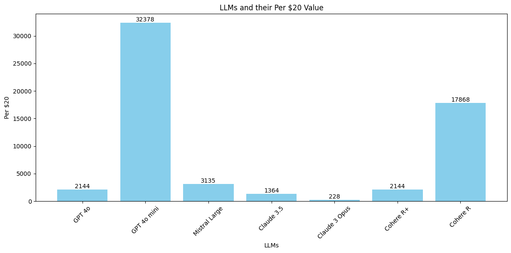

# How many prompts & outputs will $20 buy you using an LLM API?

Date: Nov 12th 2024

## Method

- A random prompt and output was saved and recorded (`/examples/1.md`)
- The access costs of major cloud-hosted LLM APIs were gathered and recorded using data from the providers themselves. 
- The data was gathered on 12-Nov-24 and input and output tokens were captured as they were expressed (US dollars per one million tokens USD/MTok). For the purpose of simplicity, discounts were ignored (some providers offer discounts for routing prompts to a random endpoint, for example)
- The sample prompt and output were tokenised using a tokenisation calculator. For Cohere, an average of the other tokenisation values was used. 

## Calculations

The data was combined and calculated as follows: 

- The calculated token usage for inputs and outputs was divided by one million
- That number was multipled by the MTok values for input and output tokens respectively. 
- Then, the numbers were added to give a total cost for this sample prompt and output (`1.md`). 
- Finally, 20 was divided by this number and the result was rounded to the nearest integer. 
- This number represents how many of the sample prompts could be carried out at $20 of expenditure. 
- Finally, that figure was then divided by 30 to estimate how many prompts-and-outputs per day such as prompting budget would afford in a typical calendar month.

## Summary

| LLM              | Total Cost ($) | Per $20 | Per-Day |
|------------------|------------|-----------|---------|
| GPT 4o           | 0.009328   | 2144      | 71      |
| GPT 4o mini      | 0.000618   | 32378     | 1080    |
| Mistral Large    | 0.006380   | 3135      | 105     |
| Claude 3.5       | 0.014664   | 1364      | 46      |
| Claude 3 Opus    | 0.087660   | 228       | 7.6     |
| Cohere R+        | 0.009328   | 2144      | 71      |
| Cohere R        | 0.0011193   | 17868      | 596      |

---

## Charts

### Total prompts-and-outputs per $20 API spend

Method: as above

 

### Per-day prompts-and-outputs for $20 monthly spend cap

---

# Source Data

## LLM API Costs, 12-Nov-2024

# Comparison Of Major LLM API Costs Nov 12th 2024

| Provider   | Model                        | Input Price (USD/Mtok) | Output Price (USD/Mtok) |
|------------|------------------------------|------------------------|-------------------------|
| OpenAI     | Gpt-40                       | 2.50                   | 10                      |
| OpenAI     | gpt-4o-2024-08-06            | 2.50                   | 10                      |
| OpenAI     | GPT-4o mini                  | 0.15                   | 0.6                     |
| OpenAI     | chatgpt-4o-latest            | 5.00                   | 15                      |
| Anthropic  | Claude 3.5 Sonnet            | 3.00                   | 15                      |
| Anthropic  | Claude 3.5 Haiku             | 1.00                   | 5                       |
| Anthropic  | Claude 3 Opus                | 15.00                  | 75                      |
| Mistral    | Large 2                      | 2.00                   | 6                       |
| Mistral    | Small 24.09                  | 0.20                   | 0.6                     |
| Mistral    | Codestral                    | 0.20                   | 0.6                     |
| Google     | Gemini 1.5 Flash (Paid Tier) | 0.07                   | 0.30                    |
| Google     | Gemini 1.5 Pro (Paid Tier)   | 1.25                   | 5                       |
| Cohere     | Command R+                   | 2.50                   | 10                      |
| Cohere     | Command R                    | 0.30                   | 1.2                     |
